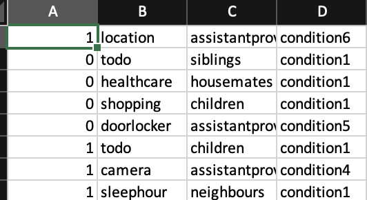
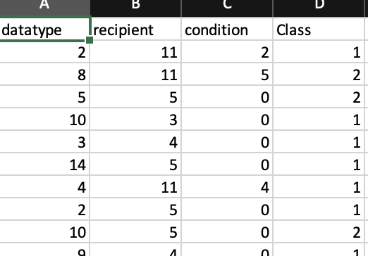

# Dialogue Agent Research

> This is the code implementation of project/paper xxxxxxx.


## [NN_incremental]
Neural Network implementation, use `./run.sh` to run the model.


***Data requirements***
```
Neumerical data
```


## [tree_incremental]
Incremental decision trees code implementation, use `python main.py --dataset <name> --tree v e --shuffle --verbose --plot` to run the experiment.

***Data requirements***
```
Plaintext data
```


## [tree_naive]
Basic decision tree with rule extraction method.
Go to `/code/src/helpers/pre_data.py` for more details.

***Data requirements***
```
Plaintext data
```

-----
Update:
`DialogueAgentResearch/data/incremental_numerical` contains the numerical data which has been splitted to incremental set, train set, and test set.